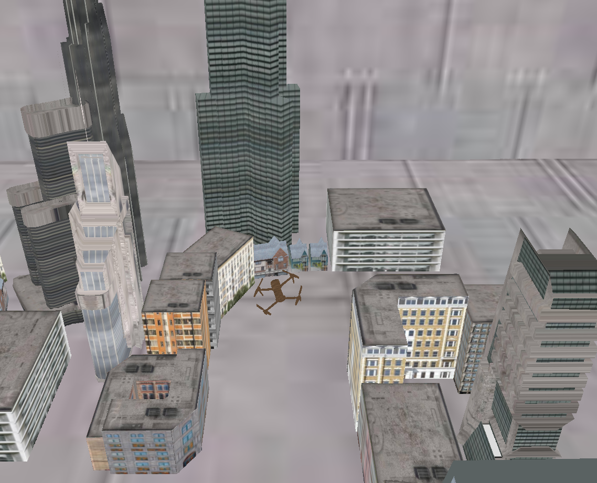

# OpenGL-3D-Engine
# OpenGL-3D-Drone-Simulator

A 3D drone simulation with physics, collision detection, and real-time transformations. Built using **OpenGL, CGAL, Assimp, and GLFW**.

## What is This Project?
This project started as a **drone simulator**, but it naturally evolved into a **mini-engine** that allows easy integration of new objects with collision detection, movement, and rendering. 

The key feature is its **modular design**—new models can be added to the scene **just like in Unity**, with automatic physics integration, rendering, and movement.

## Main Highlights
### 🚀 **As a Simulator**:
- Dynamic **drone movement & physics**
- Collision detection between the drone and environment
- Real-time transformation updates

### 🛠️ **As an Engine**:
- **Modular Scene Objects** (like `ModelObject`, `SceneObject`) allow **easy addition of new entities**
- Supports **any custom 3D model** (loaded via Assimp)
- **Physics & collision** (grid-based & CGAL-based)
- Extendable with new mechanics, models, and interactions

## Project Structure
```
OpenGL-3D-Drone-Simulator/
│── Core_Entities/       # Core game engine entities (Camera, ObjectManager)
│── Engine_Objects/      # Base classes for scene objects
│── OpenGL_Rendering/    # Rendering pipeline (Shaders, Models, Meshes)
│── Room1/               # Scene-specific objects (Cube, Drone, City) and the Main.cpp entry point
│── Utils/               # Math, Physics, and utility functions
```

### Notes:
- **EntityObject** is currently unused and may be refactored in the future.
- The project was initially **not intended to be an engine**, but it evolved into one.
- With large models, performance degrade, potentially causing lag - on future improvements
- The drone model is currently large, resulting in approximately a 2-minute load time for each run.


## Preview


## Future Improvements
- **Optimize collision system** (BVH planned)
- **Improve rendering pipeline performance**
- **Enhance drone physics realism**

## Credits
This project was developed intensively over three weeks, followed by intermittent improvements over a span of several months as an experiment in real-time physics and rendering. Future plans involve optimizing collision detection and improving modularity. Contributions and suggestions are welcome!
